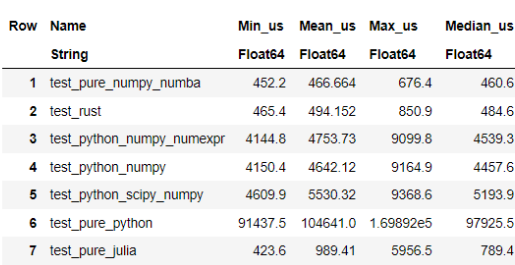
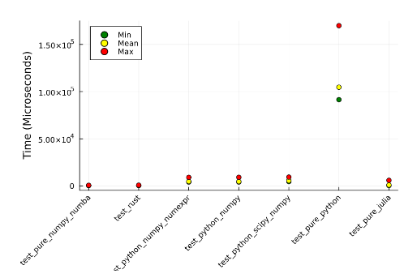

# Performance Benchmarking: Python vs Rust vs Julia

This repository contains code and benchmark tests that compare the performance of Python, Rust, and Julia in computing entropy. This project aims to identify which programming language performs entropy calculations most efficiently.

## Overview

The code in this repository uses several different implementations to calculate entropy across three programming languages: Python, Rust, and Julia. We have designed the tests to be as comparable as possible across these languages to ensure a fair and accurate performance comparison.

## Files Description

- `entropy.py`, `entropy_pure_python.py`, `entropy_python_data_science.py`: These Python scripts demonstrate different methods of computing entropy using pure Python and data science libraries.
- `entropy_rust.py`: This script interfaces with Rust code to calculate entropy, showcasing the potential performance benefits of Rust.
- `rust_entropy_lib.pyd`: A Python-compatible dynamic library built from Rust code for entropy calculation.
- `Julia-Benchmark-Test.ipynb`: A Jupyter notebook that uses Julia for entropy calculations, focusing on performance.

## Benchmark Results

We provide visual representations of our benchmark tests:
- 
  - Shows a DataFrame comparison of computation times and efficiency between Python, Rust, and Julia.
- 
  - Provides detailed visual analysis of performance metrics across different test scenarios.

## Requirements

To run the code in this repository, you will need to install the dependencies listed in `requirements.txt`. Additionally, to execute Rust and Julia code, ensure you have the appropriate environments set up.

## Running the Tests

Instructions for running the benchmark tests:
1. **Python**: Navigate to the repository directory and run `python entropy_python_data_science.py`
2. **Rust**: Ensure that Rust is installed and run `python entropy_rust.py`
3. **Julia**: Open the `Julia-Benchmark-Test.ipynb` in Jupyter Notebook and execute the cells.

## Benchmark Tests

To run the benchmark tests for the Python entropy calculation, use the pytest framework with the following command:

```bash
$ pytest --benchmark-min-rounds=120 --benchmark-histogram=histogram entropy.py

```
## Conclusion

This repository provides insights into the computational efficiency and performance differences between Python, Rust, and Julia when performing identical tasks. The benchmarks suggest that while each language has its strengths, certain scenarios may benefit more from one language over the others.
